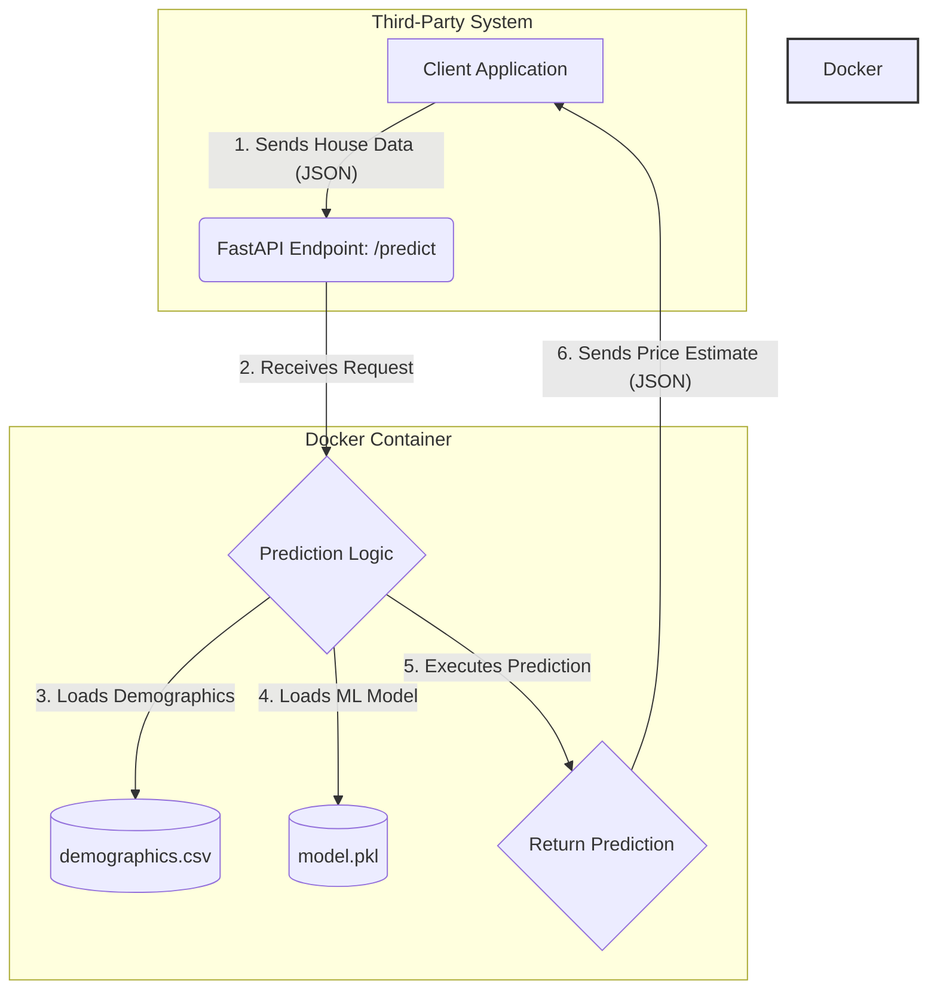

# House Price Prediction API

This project implements a machine learning model for house price prediction as a scalable RESTful service.

## Project Structure

- `docs/` - Documentation files (presentations in Markdown and PDF formats)
- `src/` - Source code files (Python scripts, Dockerfile, HTML interface, data)
- `model/` - Trained model artifacts

## Quick Start

1. Install dependencies using Conda:
   ```bash
   conda env create -f conda_environment.yml
   conda activate housing
   ```

2. Train the model:
   ```bash
   python src/create_model.py
   python src/create_improved_model.py
   ```

3. Evaluate model performance:
   ```bash
   python src/evaluate_model.py
   ```

4. Run the API service with Docker:
   ```bash
   docker build -t house-price-prediction .
   docker run -p 8000:8000 house-price-prediction
   ```

5. Test the API:
   ```bash
   python src/test_api.py
   ```

## API Usage

After starting the service, you can access the API at `http://localhost:8000/predict` by sending a POST request with JSON data containing house features.

## Technical Implementation Details

### Architecture and Design Choices

Simple, robust architecture using modern open-source tools.



*   **API Framework:** **FastAPI**
    *   High performance, asynchronous support, automatic validation, OpenAPI documentation.

*   **Containerization:** **Docker**
    *   Consistent environment for development/deployment, simplified dependency management.

*   **Data Handling:**
    *   House data sent via JSON to `/predict` endpoint.
    *   `zipcode_demographics.csv` loaded into pandas DataFrame at startup.
    *   **Production Consideration:** Migrate demographic data to PostgreSQL for scalability.

### Model Evaluation and Improvement

#### Initial Model

*   **Algorithm:** `KNeighborsRegressor` with `RobustScaler`.
*   **Features:** Small subset of numeric columns.
*   **Performance:**
    *   **R-squared:** 0.7284
    *   **Mean Absolute Error:** $102,337.19

#### Improved Model

Developed an improved model per project recommendations.

*   **Algorithm:** `GradientBoostingRegressor`
    *   More powerful ensemble method with higher accuracy than k-NN.
*   **Feature Engineering:**
    *   Used all available numeric features.
    *   Extracted `sale_year` and `sale_month` from `date` field.
*   **Performance:**
    *   **R-squared:** **0.8804** (+21% improvement)
    *   **Mean Absolute Error:** **$69,841.29** (32% improvement)

Substantial improvement in prediction accuracy.

### Scalability and Future Work

*   **Scalability:** Containerized API allows easy scaling. Kubernetes deploys multiple instances with load balancing for high availability.

*   **Model Versioning:** Current setup loads model at startup. Robust strategy:
    1.  Store model artifacts in MLflow or S3.
    2.  Create `/-/reload_model` endpoint for zero-downtime updates.

*   **Future Improvements:**
    *   Hyperparameter tuning with GridSearchCV.
    *   Advanced feature engineering for geographical data.

### Cloud Deployment Strategy

Production deployment in the cloud using:

#### Container Orchestration

*   **Kubernetes** (preferred) or **AWS ECS**
    *   Horizontal scaling based on demand
    *   High availability through replica management
    *   Rolling updates for zero-downtime deployments
    *   Key Components: Deployments, Services, Ingress, ConfigMaps, Secrets

#### Cloud Provider Options

*   **AWS:** EKS, ALB, S3, CloudWatch
*   **GCP:** GKE, Cloud Load Balancing, Cloud Storage, Cloud Monitoring
*   **Azure:** AKS, Application Gateway, Azure Blob Storage, Azure Monitor

#### Model Registry and Versioning

*   **MLflow** (recommended):
    *   Model registry with version control
    *   Performance metrics comparison
    *   Model stage transitions

*   **Alternatives:** S3/GCS/Azure Blob with manual versioning, DVC, Weights & Biases

#### CI/CD Pipeline

*   **GitHub Actions** or **GitLab CI/CD**:
    *   Stages: Testing, Building, Security Scanning, Deployment
    *   Tools: pytest, Docker Hub/ECR, kubectl, notifications

#### Monitoring and Observability

*   **APM:** Prometheus, Grafana
*   **Metrics:** Response times, throughput, error rates, resource utilization
*   **Logging:** ELK Stack or similar solutions
*   **Health Checks:** Liveness/readiness probes, downtime alerts

#### API Authentication and Security

*   **Methods:** JWT, API Keys, OAuth2
*   **Implementation:** FastAPI dependency injection, rate limiting
*   **Best Practices:** TLS encryption, security scanning, least privilege

#### Auto-scaling

*   Kubernetes Horizontal Pod Autoscaler (HPA)
*   Scale based on CPU utilization or custom metrics (requests/second, response time)

#### Additional Considerations

*   **Backup/Recovery:** Regular backups, cross-region replication
*   **Cost Optimization:** Resource tuning, spot instances, auto-scaling policies

Comprehensive cloud deployment strategy ensures scalability, reliability, and maintainability.