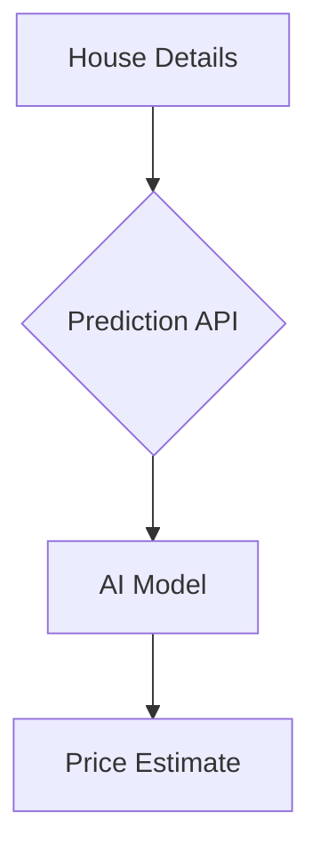

# Sound Realty: Unlocking Value with AI

## The Challenge: The Time-Consuming Nature of Appraisals

In today's fast-moving real estate market, spending significant time and effort on manually estimating property values can slow down your business and introduce inconsistencies.

## Our Solution: An Instant, Data-Driven Valuation Tool

We have developed an AI-powered tool that provides instant and reliable estimates for property values in the Seattle area. 

### How It Works

Our tool is a simple API that allows your internal systems to get a price estimate by providing the basic features of a house. Our system automatically enriches this information with local demographic data to provide a comprehensive, data-driven prediction.



### Demonstration

Here is an example of a prediction for a property:

**Input:**
```json
{
  "bedrooms": 3,
  "bathrooms": 2.5,
  "sqft_living": 2220,
  "zipcode": "98115",
  ...
}
```

**Our Tool's Prediction:**
```json
{
  "prediction": 612800.0
}
```

## Key Benefits

*   **Speed:** Get property value estimates in seconds, not hours.
*   **Consistency:** Remove human bias and ensure a standardized valuation process.
*   **Data-Driven Insights:** Leverage thousands of historical sales and demographic data points for every estimate.

## Next Steps: Continuous Improvement

The model we've deployed is a strong starting point. We have already developed an improved version that is **over 30% more accurate**.

We recommend moving forward with this enhanced model and exploring further improvements to give Sound Realty the most competitive edge in the market.