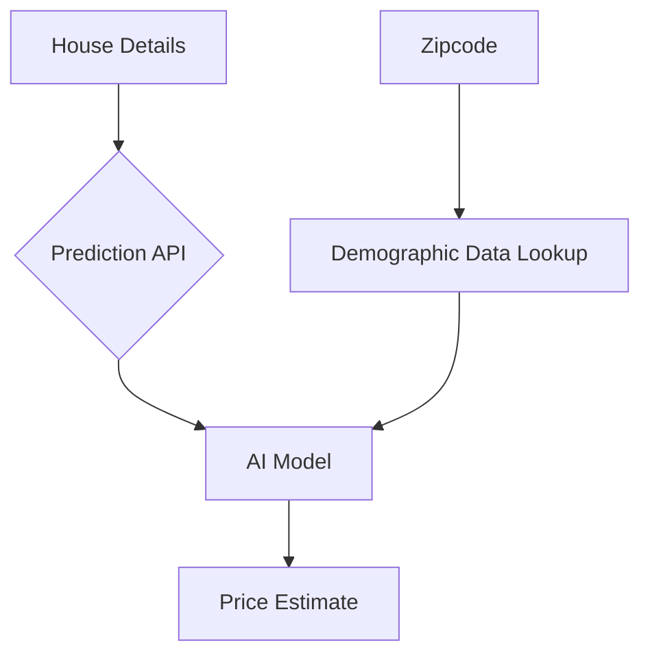

# Sound Realty: Unlocking Value with AI

## The Challenge: The Time-Consuming Nature of Appraisals

In today's fast-moving real estate market, spending significant time and effort on manually estimating property values can slow down your business and introduce inconsistencies. Traditional appraisal methods often require hours of research, analysis, and expert judgment, which can delay property listings and affect your competitive edge in the Seattle market.

## Our Solution: An Instant, Data-Driven Valuation Tool

We have developed an AI-powered tool that provides instant and reliable estimates for property values in the Seattle area. This solution streamlines your valuation process while maintaining accuracy, allowing your team to focus on what they do best - serving clients and closing deals.

### What Data We Use to Predict Home Values

Our model analyzes multiple factors that influence home prices in the Seattle area:

**Property Features:**
*   **Size:** Square footage of living space and lot size
*   **Layout:** Number of bedrooms and bathrooms
*   **Condition:** Overall condition and grade of construction
*   **Age:** Year built and renovation information
*   **Location:** Zip code, latitude, and longitude

**Neighborhood Demographics:**
*   **Population Characteristics:** Age distribution, household size
*   **Economic Factors:** Median income, employment rates
*   **Housing Market Data:** Population density, housing density

By combining these factors, our model captures both the specific attributes of a property and the broader market conditions of its neighborhood.

### How It Works

Our tool is a simple API that allows your internal systems to get a price estimate by providing the basic features of a house. Our system automatically enriches this information with local demographic data to provide a comprehensive, data-driven prediction.



### Demonstration

Here is an example of a prediction for a property:

**Input:**
```json
{
  "bedrooms": 3,
  "bathrooms": 2.5,
  "sqft_living": 2220,
  "sqft_lot": 7350,
  "floors": 2,
  "waterfront": 0,
  "view": 0,
  "condition": 3,
  "grade": 8,
  "yr_built": 1945,
  "yr_renovated": 0,
  "zipcode": "98115",
  "lat": 47.6764,
  "long": -122.293
}
```

**Our Tool's Prediction:**
```json
{
  "prediction": 612800.0,
  "zipcode": "98115",
  "neighborhood_median_income": 92797.0
}
```

## Key Benefits

*   **Speed:** Get property value estimates in seconds, not hours.
*   **Consistency:** Remove human bias and ensure a standardized valuation process.
*   **Data-Driven Insights:** Leverage thousands of historical sales and demographic data points for every estimate.
*   **Market Awareness:** Automatically incorporate neighborhood demographic trends that affect property values.

## Next Steps: Continuous Improvement

The model we've deployed is a strong starting point. We have already developed an improved version that is **over 30% more accurate**.

We recommend moving forward with this enhanced model and exploring further improvements to give Sound Realty the most competitive edge in the market. The improved model uses advanced machine learning techniques that better capture the complex relationships between property features and market values.