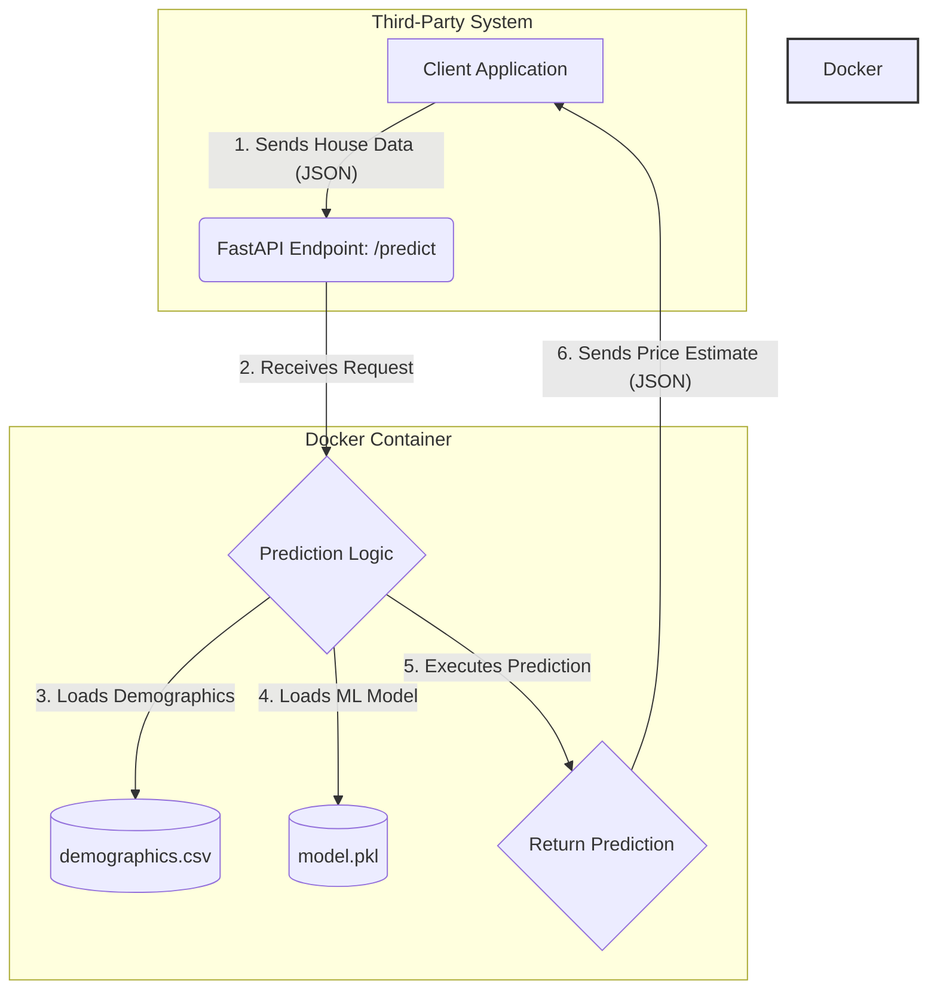

# Technical Presentation: House Price Prediction API

## 1. Project Overview

The goal was to deploy a machine learning model for house price prediction as a scalable, reliable RESTful service. Key deliverables included the API, a test script, and a model performance evaluation.

---

## 2. Architecture and Design Choices

We opted for a simple, robust, and scalable architecture using modern, open-source tools.

*   **API Framework:** **FastAPI**
    *   **Reasoning:** High performance, asynchronous support, automatic data validation via Pydantic, and self-generating OpenAPI documentation.

*   **Containerization:** **Docker**
    *   **Reasoning:** Ensures a consistent and portable environment for development and deployment, simplifying dependency management.

*   **Data Handling:**
    *   The primary house data is sent via a JSON payload to the `/predict` endpoint.
    *   The `zipcode_demographics.csv` data is loaded into a pandas DataFrame at startup for efficient, in-memory joining. 
    *   **Production Consideration:** For a full-scale production environment, this demographic data would be migrated to a relational database (e.g., PostgreSQL) to improve scalability and maintainability.

---

## 3. Model Evaluation and Improvement

### Initial Model

*   **Algorithm:** `KNeighborsRegressor` with `RobustScaler`.
*   **Features:** A small subset of numeric columns.
*   **Performance:**
    *   **R-squared:** 0.7284
    *   **Mean Absolute Error:** $102,337.19

### Improved Model

Per the project recommendations, we developed an improved model to create an "80% solution."

*   **Algorithm:** `GradientBoostingRegressor`
    *   **Reasoning:** A more powerful ensemble method that typically provides higher accuracy than k-NN on tabular data.
*   **Feature Engineering:**
    *   Used **all** available numeric features from the combined dataset.
    *   Extracted `sale_year` and `sale_month` from the `date` field to capture time-based price trends.
*   **Performance:**
    *   **R-squared:** **0.8804** (+21% improvement)
    *   **Mean Absolute Error:** **$69,841.29** (32% improvement)

This represents a substantial improvement in prediction accuracy.

---

## 4. Scalability and Future Work

*   **Scalability:** The containerized nature of the API allows for easy scaling. Using an orchestrator like **Kubernetes**, we can deploy multiple instances of the API and use a load balancer to distribute traffic, achieving high availability and throughput.

*   **Model Versioning:** The current setup loads the model at startup. A robust versioning strategy would involve:
    1.  Storing model artifacts in a dedicated model registry (like MLflow or S3).
    2.  Creating a new API endpoint (e.g., `/-/reload_model`) that dynamically loads a new model version into memory without requiring a service restart, enabling zero-downtime updates.

*   **Future Improvements:**
    *   **Hyperparameter Tuning:** Perform a systematic search (e.g., GridSearchCV) to find the optimal parameters for the `GradientBoostingRegressor`.
    *   **Advanced Feature Engineering:** Explore interaction terms between features and more complex handling of geographical data (`lat`, `long`) beyond using them as simple numeric inputs.
